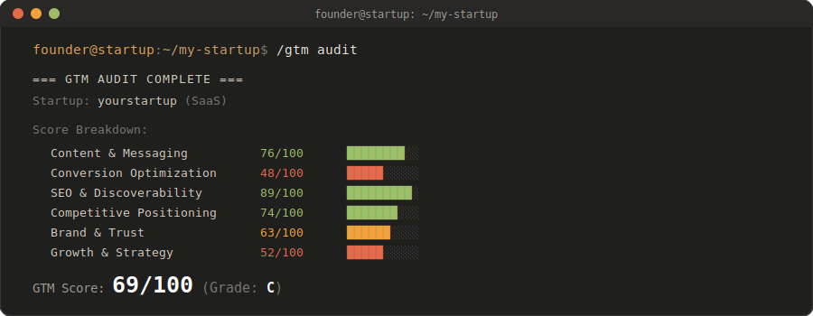

<p align="center">
  
</p>

# Adaptico OS - the go-to-market operating system for SaaS and AI founders

Plug your startup into Claude Code and get a real go-to-market team on the command line. Adaptico OS audits your marketing, sharpens your positioning, fixes your conversion, writes your copy, plans your launch, and tracks your competitors - tuned specifically for **early-stage SaaS and AI startup founders**.

It's more than a set of skills - it's an orchestrator that puts a whole team of specialists on your startup and runs them in parallel if needed. Install it, run `/gtm init` once, and you've got a GTM advisor that already knows your product. Built for technical founders shipping modern software.

---

## What it does

Each Adaptico OS command puts a specialist on one part of your go-to-market - positioning, conversion, copy, a launch plan, a competitor breakdown. 

After `/gtm init`, the next one to run is `/gtm audit`: it sends a whole team across your site at once, scores six GTM dimensions, and rolls them into a single score out of 100 with the biggest fixes ranked first:

<p align="center">
  
</p>

Every run saves a dated report you can work through, and re-running it week to week turns the score into a progress tracker.

---

## Quick start

```bash
# 1. Install the skills into your project
curl -fsSL https://raw.githubusercontent.com/adaptico/adaptico-os/main/install.sh | bash

# 2. Open Claude Code in your project and set up your startup
/gtm init

# 3. Run it
/gtm audit
/gtm position
/gtm landing
```

Or install manually:

```bash
git clone https://github.com/adaptico/adaptico-os.git
cd adaptico-os

# macOS / Linux:
./install.sh

# Windows:
bash install.sh
```

After installing, restart Claude Code so it picks up the new skills.

---

## Commands

| Command | What it does |
|---------|-------------|
| `/gtm init` | Set up your startup profile (`PROFILE.md`) - do this first |
| `/gtm audit` | Full GTM audit with parallel agents + composite score |
| `/gtm quick` | 60-second snapshot - top wins and fixes |
| `/gtm position` | Positioning map vs competitors + a positioning statement |
| `/gtm competitors` | Competitive intelligence on other SaaS in your space |
| `/gtm launch` | Launch playbook (Product Hunt / Hacker News / X) |
| `/gtm copy` | Before/after copy rewrites for any page |
| `/gtm landing` | Landing page CRO, tuned for SaaS signup/trial flows |
| `/gtm funnel` | Funnel & activation analysis - find the leaks (trial / PLG) |
| `/gtm outreach` | Cold outbound sequences - cold email & LinkedIn DM |
| `/gtm emails` | Activation onboarding & dunning (failed-payment recovery) email sequences |
| `/gtm social` | Founder-led social: join conversations where buyers are, plus an X/LinkedIn calendar |
| `/gtm brand` | Brand voice audit + a reusable voice guide (do's & don'ts, copy samples) |

Point any command at a URL (`/gtm audit https://example.com`), or pass a saved project's name (`/gtm audit my-startup`) to skip retyping the URL. With a single project set up, running a command bare just uses it.

---


## Uninstall

```bash
# macOS / Linux
./uninstall.sh

# Windows (Git Bash)
bash uninstall.sh
```

---

## License

MIT - see [LICENSE](LICENSE). Third-party notices: [CREDITS.md](CREDITS.md).

## Trademark

"Adaptico" and "Adaptico OS" are trademarks of the Adaptico project. The MIT license covers the code, not the name or logo. If you fork or redistribute, please use your own name and don't present your version as official Adaptico or imply endorsement.

## More

- See [AGENTS.md](AGENTS.md) for architecture and technical details
- See [CHANGELOG.md](CHANGELOG.md) for version history
