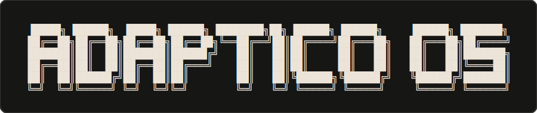

<p align="center">
  
</p>

# Adaptico OS - the go-to-market operating system for founders

Plug your startup into Claude Code and get a real go-to-market team on the command line. Adaptico OS audits your marketing, sharpens your positioning, fixes your conversion, writes your copy, plans your launch, and tracks your competitors - tuned specifically for **early-stage SaaS and AI startup founders**.

It's more than a set of skills - it's an orchestrator that routes each request to the right specialists and runs them in parallel. You install it, run `/gtm init` once, and then talk to it like a GTM advisor who already knows your product. Built for technical founders shipping modern software.

---

## What it does

```
> /gtm audit

Launching parallel agents on yourstartup.com...
✓ Content & Messaging     - 72/100
✓ Conversion Optimization - 58/100
✓ SEO & Discoverability   - 81/100
✓ Competitive Positioning - 64/100
✓ Brand & Trust           - 76/100
✓ Growth & Strategy       - 61/100

GTM Score: 69/100  →  saved to 2026-05-31-gtm-audit.md
Top fix: your homepage explains what you built, not who it's for or why it matters.
```

---

## Quick start

```bash
# 1. Install the skills into your project
curl -fsSL https://raw.githubusercontent.com/adaptico/adaptico-os/main/install.sh | bash

# 2. Open Claude Code in your project and set up your startup
/gtm init

# 3. Run it
/gtm audit
/gtm position
/gtm landing
```

Manual install:

```bash
git clone https://github.com/adaptico/adaptico-os.git
cd adaptico-os

# macOS / Linux
./install.sh

# Windows - PowerShell and cmd can't run .sh files, so run it through Git Bash:
bash install.sh
```

After installing, restart Claude Code so it picks up the new skills.

---

## Commands

| Command | What it does |
|---------|-------------|
| `/gtm init` | Set up your startup profile (`PROFILE.md`) - do this first |
| `/gtm audit` | Full GTM audit with parallel agents + composite score |
| `/gtm quick` | 60-second snapshot - top wins and fixes |
| `/gtm position` | Positioning map vs competitors + a positioning statement |
| `/gtm competitors` | Competitive intelligence on other SaaS in your space |
| `/gtm launch` | Launch playbook (Product Hunt / Hacker News / X) |
| `/gtm copy` | Before/after copy rewrites for any page |
| `/gtm landing` | Landing page CRO, tuned for SaaS signup/trial flows |
| `/gtm funnel` | Funnel & activation analysis - find the leaks (trial / PLG) |

Point any command at a URL (`/gtm audit https://example.com`), or pass a saved project's name (`/gtm audit my-startup`) to skip retyping the URL. With a single project set up, running a command bare just uses it.

---

## How it works

1. **You run a command** - e.g. `/gtm audit`.
2. **Claude reads the skill files** - they tell it exactly how to analyze your startup.
3. **Agents and scripts do the work** - specialized agents work in parallel, each focused on a different GTM dimension (content, conversion, SEO, positioning, brand, growth), while Python utilities extract page data and scan competitors.
4. **You get a scored, prioritized, founder-honest report** - saved as a dated Markdown file you can act on or share.
---


## Uninstall

```bash
# macOS / Linux
./uninstall.sh

# Windows (Git Bash)
bash uninstall.sh
```

---

## License

MIT - see [LICENSE](LICENSE). Third-party notices: [CREDITS.md](CREDITS.md).

## Trademark

"Adaptico" and "Adaptico OS" are trademarks of the Adaptico project. The MIT license covers the code, not the name or logo. If you fork or redistribute, please use your own name and don't present your version as official Adaptico or imply endorsement.

## More

- See [AGENTS.md](AGENTS.md) for architecture and technical details
- See [CHANGELOG.md](CHANGELOG.md) for version history
